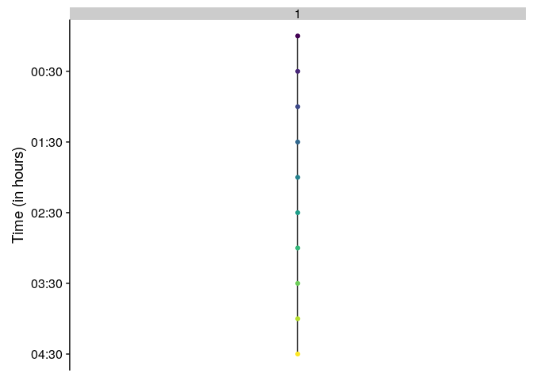
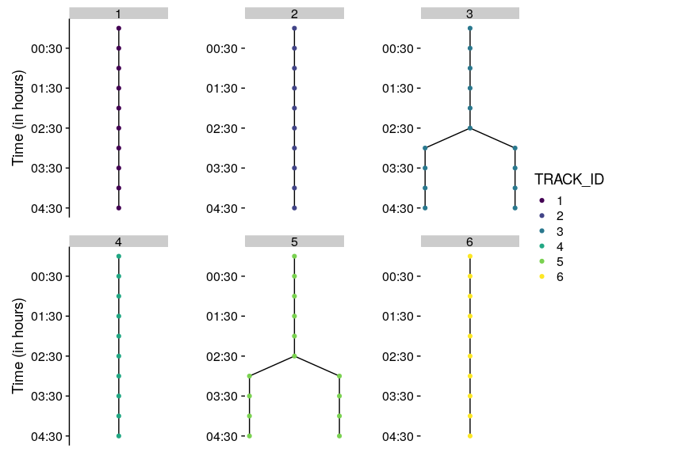

<!-- README.md is generated from README.Rmd. Please edit that file -->
[](https://travis-ci.org/marionlouveaux/mamut2r) [](https://ci.appveyor.com/project/marionlouveaux/mamut2r) [](https://doi.org/10.5281/zenodo.1467431)

mamut2r
=======

The goal of {mamut2r} is to imports data coming from .xml files generated with the Fiji MaMuT plugin for lineage and tracking of biological objects. {mamut2r} also allows to create lineage plots.

How to cite
-----------

To cite {mamut2r}, call the R built-in command `citation("mamut2r")`.

> Marion Louveaux, & Sébastien Rochette. (2018, October 19). mamut2r: a R package to import and visualize xml files from the MaMuT Fiji plugin (Version v0.0.2). Zenodo. <http://doi.org/10.5281/zenodo.1467431>

Installation
------------

{mamut2r} is only available on Github.

``` r
# install.packages("remotes")
remotes::install_github("marionlouveaux/mamut2r")
# With dependencies
remotes::install_github("marionlouveaux/mamut2r", dependencies = c("Depends", "Imports"))
```

**Please read the following before trying to install:**

### You may want to install dependencies before

{rhdf5} is only needed if you want to extract fluorescence intensity from HDF5 files as presented in this vignette: <https://marionlouveaux.github.io/mamut2r/articles/B_fluo.html> *Note that last version of {rhdf5} requires R&gt;=3.5*

``` r
# rhdf5 (>= 2.24.0) on bioconductor is required
install.packages("BiocManager")
BiocManager::install("rhdf5", update = FALSE)

# Other packages on CRAN
to_install <- c("classInt", "cowplot", "dplyr", "ggplot2", "ggraph", "ggridges", "glue", "grDevices", "igraph", "knitr", "magrittr", "pkgdown", "purrr", "rhdf5", "rmarkdown", "stats", "tibble", "tidyr", "utils", "viridis", "XML", "xml2")
for (i in to_install) {
  message(paste("looking for ", i))
  if (!requireNamespace(i)) {
    message(paste("     installing", i))
    install.packages(i)
  }
  
}
```

### Linux and MacOS

*For Linux and MacOS* To install {ggraph}, you will need "udunits".

-   *Ubuntu:*

        sudo apt-get install --yes libudunits2-dev

-   *MacOS:*

        brew install udunits

### Windows: Installing Rtools on with R 3.5

You need to have Rtools installed to be able to install this package from Github. Rtools is not a R package, this a *collection of resources for building packages for R under Microsoft Windows*. You may encounter some problems with Rtools installation, if so, please follow these instructions:

*Please fill `\*your_path\*` (in the 3 places) with the correct path to Rtools installation that you chose during the installation procedure*

``` r
# Packages
install.packages("pkgbuild")
install.packages("devtools")

# Test Rtools
pkgbuild::find_rtools() 
# If FALSE follow instructions

#Rtools ----
# Go to http://cran.r-project.org/bin/windows/Rtools/ and download at least Rtools35.exe
# Install downloaded file

# Set path of Rtools 
Sys.setenv(PATH = paste(Sys.getenv("PATH"), "*your_path*/Rtools/bin/"), "*your_path*/Rtools/mingw_64/bin", sep = ";")) 
# For 64 bit version
Sys.setenv(BINPREF = "*your_path*/Rtools/mingw_64/bin")

# Manually "force" version to be accepted 
# This may not be needed
library(devtools)
assignInNamespace("version_info", c(devtools:::version_info, list("3.5" = list(version_min = "3.3.0", version_max = "99.99.99", path = "bin"))), "devtools") 

# Test your installation
pkgbuild::find_rtools() # should be TRUE now

# Installation ---
install.packages("remotes")
remotes::install_github("marionlouveaux/mamut2r")
# Or with dependencies
remotes::install_github("marionlouveaux/mamut2r",
                        dependencies = c("Depends", "Imports"))
```

Full documentation with {pkgdown}
---------------------------------

See full documentation created with {pkgdown} at <https://marionlouveaux.github.io/mamut2r/>

Open Rmd files used to build vignettes
--------------------------------------

You may need to install {cellviz3d}, and you will need to install mamut2r with the vignettes.

``` r
devtools::install_github("marionlouveaux/cellviz3d")
devtools::install_github("marionlouveaux/mamut2r", build_vignettes = TRUE)

file.edit(system.file(file.path("doc", "vignette_fluo.Rmd"), package = "mamut2r"))
file.edit(system.file(file.path("doc", "vignette_getting_started.Rmd"), package = "mamut2r"))
```

Getting started
---------------

``` r
library(mamut2r)
library(dplyr)
library(cowplot)
library(purrr)
library(XML)
```

### Loading .xml MaMuT file

The mamut.xml file is loaded as a list in R using the xmlToList() function from the {XML} package.

``` r
fileXML <- xmlToList(system.file("extdata", "MaMuT_Parhyale_demo-mamut.xml", package = "mamut2r"))
```

### Getting information relative to either nuclei (= spots) or lineages (=tracks)

The MaMuT .xml file stores two type of objects, under two types of tags: the spots and the tracks. In the case of the study of the development of an organ, spots usually refer to nuclei and tracks to cell lineages. Here, Spots.as.dataframe() and Tracks.as.dataframe() extract information from the .xml file and format them as dataframes (more precisely as tibbles).

Information regarding the spots (x, y, z location, ID...) are extracted using the Spots.as.dataframe and stored in a tibble.

``` r
Spots_df <- Spots.as.dataframe(fileXML)
Spots_df
#> # A tibble: 441 x 11
#>       ID name  VISIBILITY RADIUS QUALITY SOURCE_ID POSITION_T POSITION_X
#>    <int> <chr> <chr>       <dbl> <chr>   <chr>          <dbl>      <dbl>
#>  1  2115 ID21… 1            14.6 -1.0    0                  0       834.
#>  2  3077 ID30… 1            14.6 -1.0    0                  0       788.
#>  3  1542 ID15… 1            14.6 -1.0    0                  0       865.
#>  4  3398 ID33… 1            14.6 -1.0    0                  0       945.
#>  5  2569 ID25… 1            14.6 -1.0    0                  0       888.
#>  6  1930 ID19… 1            14.6 -1.0    0                  0       836.
#>  7  2956 ID29… 1            14.6 -1.0    0                  0       788.
#>  8  3597 ID35… 1            14.6 -1.0    0                  0      1086.
#>  9   337 ID337 1            14.6 -1.0    0                  0      1046.
#> 10  3025 ID30… 1            14.6 -1.0    0                  0       817.
#> # … with 431 more rows, and 3 more variables: POSITION_Y <dbl>,
#> #   FRAME <chr>, POSITION_Z <dbl>
```

Information regarding the tracks (ID of source and target spots, track ID...) are extracted using the Tracks.as.dataframe and stored in a tibble.

``` r
Tracks_df <- Tracks.as.dataframe(fileXML)
Tracks_df
#> # A tibble: 400 x 8
#>    SPOT_SOURCE_ID SPOT_TARGET_ID LINK_COST VELOCITY DISPLACEMENT TRACK_NAME
#>             <int>          <int> <chr>        <dbl>        <dbl> <chr>     
#>  1            135            142 103.6346…     5.81         5.81 Track_1   
#>  2            179            182 -1.0         18.6         18.6  Track_1   
#>  3            183            184 -1.0         14.6         14.6  Track_1   
#>  4            182            183 -1.0         14.6         14.6  Track_1   
#>  5            142            179 -1.0          7.20         7.20 Track_1   
#>  6            122            129 29.60479…     4.11         4.11 Track_1   
#>  7             96            116 42.20738…     2.55         2.55 Track_1   
#>  8            116            122 52.23397…     5.70         5.70 Track_1   
#>  9            129            135 30.78595…     3.60         3.60 Track_1   
#> 10            215            222 56.26781…    14.7         14.7  Track_2   
#> # … with 390 more rows, and 2 more variables: TRACK_ID <chr>,
#> #   TRACK_INDEX <chr>
```

### Checking tracks

Tracks are composed of nodes (the spots) and edges (between the spots). Source and target spots are respectively the origin and the end of an edge between two timepoints. checkTrack() checks the orientation of edges and ensure to always have the source spot in an earlier timepoint than the target spot. This is necessary for plotting the lineage trees afterwards with {ggraph}.

``` r
Tracks_df <- checkTrack(Tracks_df, Spots_df)
Tracks_df
#> # A tibble: 400 x 10
#>    SPOT_SOURCE_ID SPOT_TARGET_ID LINK_COST VELOCITY DISPLACEMENT TRACK_NAME
#>             <int>          <int> <chr>        <dbl>        <dbl> <chr>     
#>  1            135            142 103.6346…     5.81         5.81 Track_1   
#>  2            179            182 -1.0         18.6         18.6  Track_1   
#>  3            183            184 -1.0         14.6         14.6  Track_1   
#>  4            182            183 -1.0         14.6         14.6  Track_1   
#>  5            142            179 -1.0          7.20         7.20 Track_1   
#>  6            122            129 29.60479…     4.11         4.11 Track_1   
#>  7             96            116 42.20738…     2.55         2.55 Track_1   
#>  8            116            122 52.23397…     5.70         5.70 Track_1   
#>  9            129            135 30.78595…     3.60         3.60 Track_1   
#> 10            215            222 56.26781…    14.7         14.7  Track_2   
#> # … with 390 more rows, and 4 more variables: TRACK_ID <chr>,
#> #   TRACK_INDEX <chr>, SPOT_SOURCE_FRAME <dbl>, SPOT_TARGET_FRAME <dbl>
```

### Merging spots and tracks information

Spots dataframes can be enriched with information coming from the tracks using spots.and.tracks().

``` r
Spots_Tracks <- spots.and.tracks(Spots_df, Tracks_df)
Spots_Tracks
#> # A tibble: 441 x 12
#>       ID name  VISIBILITY RADIUS QUALITY SOURCE_ID POSITION_T POSITION_X
#>    <int> <chr> <chr>       <dbl> <chr>   <chr>          <dbl>      <dbl>
#>  1  2115 ID21… 1            14.6 -1.0    0                  0       834.
#>  2  3077 ID30… 1            14.6 -1.0    0                  0       788.
#>  3  1542 ID15… 1            14.6 -1.0    0                  0       865.
#>  4  3398 ID33… 1            14.6 -1.0    0                  0       945.
#>  5  2569 ID25… 1            14.6 -1.0    0                  0       888.
#>  6  1930 ID19… 1            14.6 -1.0    0                  0       836.
#>  7  2956 ID29… 1            14.6 -1.0    0                  0       788.
#>  8  3597 ID35… 1            14.6 -1.0    0                  0      1086.
#>  9   337 ID337 1            14.6 -1.0    0                  0      1046.
#> 10  3025 ID30… 1            14.6 -1.0    0                  0       817.
#> # … with 431 more rows, and 4 more variables: POSITION_Y <dbl>,
#> #   FRAME <chr>, POSITION_Z <dbl>, TRACK_ID <chr>
```

### Visualising the lineage trees

track2plot() allows to plot the lineage trees with a custom color code.
Tracks are identified by their ID.

``` r
all_tracks <- unique(Tracks_df$TRACK_ID)
```

To plot one track:

``` r
track2plot(track = "1", Tracks_df, Spots_Tracks,
           colNode = FRAME, colYaxis = "black", colNode_discrete = TRUE)
```



To plot the first six tracks:

``` r
trackset <- all_tracks[1:6]
nbrow <- 2
#display y axis only for plots on the left
colYaxis_pattern <- rep(c("black", 
                          rep("white", (ceiling(length(trackset)/nbrow)-1) ) ), nbrow) 
colYaxis <- colYaxis_pattern[1:length(trackset)]

all_layouts <- map2(trackset, colYaxis,
                    ~track2plot(.x, Tracks_df, Spots_Tracks, colNode = TRACK_ID, colYaxis = .y, colNode_discrete=TRUE, breaks = unique(trackset)))

prow <- plot_grid(plotlist = all_layouts, nrow = nbrow)
legend <- get_legend(all_layouts[[1]]+theme(legend.position="right"))
p <- plot_grid( prow, legend, rel_widths = c(1, .3))
p
```



Acknowledgements
----------------

Many thanks to Dr. Jean-Yves Tinevez, John Bogovic, and Dr. Tobias Pietsch for their help on MaMuT and Big Data Viewer, and to Dr. Mike Smith for his help on the getFluo() function.

Code of conduct
---------------

Please note that the 'mamut2r' project is released with a [Contributor Code of Conduct](CODE_OF_CONDUCT.md). By contributing to this project, you agree to abide by its terms.
